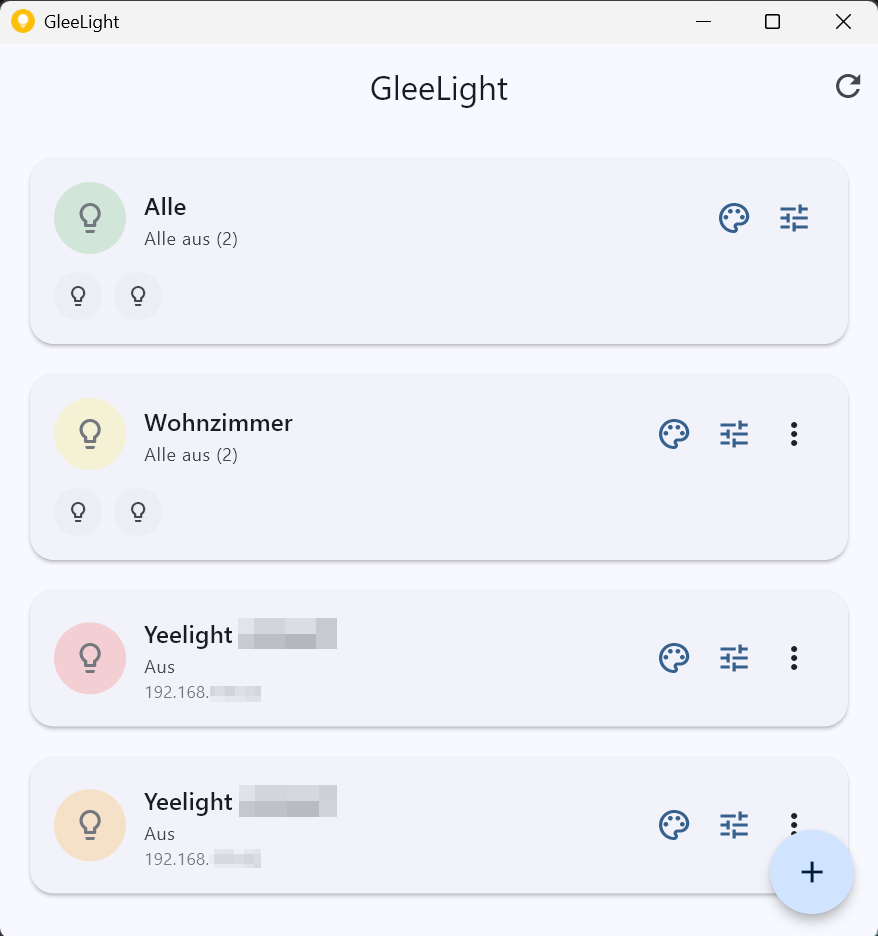

# GleeLight 🏠💡✨

A minimalistic Flutter app for local Yeelight lamp control **without cloud connection**. Based on the official Yeelight WiFi Light Inter-Operation Specification.

[](https://github.com/wi-wissen/de.gleelight/actions/workflows/ci.yml)


> **GleeLight** - Bring joy to your lighting! 😊

**[⬇️ Download the latest release](https://github.com/wi-wissen/de.gleelight/releases/latest)** &nbsp;·&nbsp; **[🌐 gleelight.de](https://gleelight.de)**



## ✨ Features

### 🔍 **Automatic Lamp Discovery**
- Automatically detects Yeelight lamps on the local network
- No manual setup process required
- Pull-to-refresh for manual updates

### 👥 **Intelligent Group Management**
- **"All"** - Controls all lamps simultaneously
- **Single Lamps** - Each lamp as its own group
- **Custom Groups** - User-defined grouping
- Automatic sorting and management

### 🎨 **Scene System**
- Predefined scenes: Warm, Bright, Dimmed
- Custom scenes with individual settings
- Easy application with a single tap

### ⚙️ **Direct Control**
- **On/Off** with last settings
- **Brightness** (1-100%)
- **Color Temperature** (1700K-6500K) for supported lamps
- Smooth transitions for gentle changes

### 📱 **Native Experience**
- Material Design 3 with automatic Dark/Light mode
- Responsive UI for all screen sizes
- Optimized for Android (iOS support possible)
- Offline display for unreachable lamps

### 🌍 **Multilingual Support**
- English
- German (Deutsch)
- Chinese (中文)
- Spanish (Español)

## 🚀 Installation & Setup

### Prerequisites
- Flutter SDK (>=3.1.0)
- Android Studio / VS Code
- Android Device/Emulator (API Level 21+)
- Yeelight lamps on the same WiFi network

> **Just want to use the app?** Skip all of this and grab a build from the
> [releases page](https://github.com/wi-wissen/de.gleelight/releases/latest).
> The steps below are for building from source.

### 1. Clone Repository
```bash
git clone https://github.com/wi-wissen/de.gleelight.git
cd de.gleelight
```

### 2. Install Dependencies
```bash
flutter pub get
```

### 3. Generate Localization Files
```bash
flutter gen-l10n
```

### 4. Start App
```bash
flutter run
```

### 5. Build Release Versions

#### Android APK (Debug-signed)

Without an `android/key.properties` the release build falls back to debug signing, so a fresh
clone builds without any setup. Such an APK runs, but it cannot be distributed — for that, see
the signing section below.

> **Note:** All Android devices since ~2020 use arm64-v8a (64-bit). A pure arm64 APK is sufficient for virtually all modern devices and is significantly smaller than a "fat" APK.

Recommended – arm64 only (smaller, sufficient for all modern devices):
```bash
flutter build apk --target-platform android-arm64
```
Alternative universal (all architectures, larger file):
```bash
flutter build apk
```
The APK can be found at:
```
build/app/outputs/flutter-apk/app-release.apk
```

**Troubleshooting:** If you encounter Kotlin compilation errors about "different roots", run:
```bash
flutter clean
flutter build apk
```

#### Android APK (Release-signed for Distribution)

To create an APK for publishing on the Play Store or for distribution, you need your own signing key:

**Step 1: Create Keystore**

Open a terminal in the project directory and run:
```bash
keytool -genkey -v -keystore android/app/upload-keystore.jks -keyalg RSA -keysize 2048 -validity 10000 -alias upload
```

You will be asked for the following information:
- **Keystore Password**: Choose a secure password (at least 6 characters)
- **Key Password**: You can use the same password (just press Enter)
- **Name, Organization, etc.**: You can fill in or leave some fields blank

⚠️ **Important**: Keep the password and the `.jks` file in a safe place! Without them you will not be able to publish app updates later.

**Step 2: Create key.properties File**

Create a file `android/key.properties` with the following content:
```properties
storePassword=YOUR_KEYSTORE_PASSWORD
keyPassword=YOUR_KEY_PASSWORD
keyAlias=upload
storeFile=upload-keystore.jks
```

Replace `YOUR_KEYSTORE_PASSWORD` and `YOUR_KEY_PASSWORD` with your actual passwords.

⚠️ **Security**: The `key.properties` file is already in `.gitignore` and will not be checked into the Git repository.

**Step 3: Create Release APK**

Now you can create the signed release APK. Recommended – arm64 only:
```bash
flutter build apk --release --target-platform android-arm64
```
Alternative universal (all architectures):
```bash
flutter build apk --release
```

The signed APK can be found at:
```
build/app/outputs/flutter-apk/app-release.apk
```

**For Play Store (recommended):**
```bash
flutter build appbundle --release
```
The App Bundle can be found at:
```
build/app/outputs/bundle/release/app-release.aab
```

#### iOS
```bash
flutter build ios
```
For distribution, you need to create an archive in Xcode:
1. Open `ios/Runner.xcworkspace` in Xcode
2. Select "Any iOS Device" as target
3. Product → Archive
4. The `.ipa` file can be exported from the Organizer

### 6. Prepare Yeelight Lamps
1. Make sure your Yeelight lamps are turned on
2. Enable "LAN Control" in the official Yeelight app:
   - Open the Yeelight app
   - Select your lamp
   - Tap the gear icon (Settings)
   - Enable "LAN Control"
3. Start the app - lamps will be detected automatically

## 📁 Project Structure

```
lib/
├── main.dart                    # App Entry Point + Theme
├── l10n/                        # Localization files
│   ├── app_en.arb              # English translations
│   ├── app_de.arb              # German translations
│   ├── app_zh.arb              # Chinese translations
│   └── app_es.arb              # Spanish translations
├── models/                      # Data models
│   ├── lamp.dart               # Lamp data model
│   ├── group.dart              # Group data model  
│   └── scene.dart              # Scene data model
├── services/                    # Business Logic
│   ├── yeelight_service.dart   # UDP Discovery + TCP Commands
│   └── storage_service.dart    # Local data persistence
├── screens/                     # UI Screens
│   ├── home_screen.dart        # Main view with groups
│   ├── settings_screen.dart    # Brightness/Color temperature
│   └── scenes_screen.dart      # Manage scenes
└── widgets/                     # Reusable UI components
    ├── group_card.dart         # Group card
    └── lamp_icon.dart          # Lamp icon with status
```

## 🔧 Usage

### Getting Started
1. **Lamp Discovery**: The app automatically searches for lamps at startup
2. **Pull-to-refresh**: Pull the list down for manual search
3. **Groups**: Lamps are automatically organized into "All" and individual groups

### Main Functions
- **Tap on Group**: Turns all lamps in the group on/off
- **Scenes Button** (🎨): Opens scene management
- **Settings Button** (⚙️): Opens brightness and color temperature controls
- **Plus Button**: Creates new custom group

### Advanced Features
- **Offline Detection**: Gray, italic display for unreachable lamps
- **Status Display**: Colored icons show Online/Offline and On/Off status
- **Last Settings**: When turning on, the last values are restored

## 🛠️ Technical Details

### Network Protocol
- **Discovery**: SSDP-like via UDP Multicast (239.255.255.250:1982)
- **Control**: JSON commands via TCP (Port 55443)
- **Based on**: Official Yeelight Inter-Operation Specification

### How it stays fast

The obvious way to send a command is to open a TCP socket, write one JSON line, and close it.
That works, but it makes every button press pay for a full TCP handshake on a Wi-Fi radio that
has usually gone idle — and if the lamp's IP changed (a renewed DHCP lease), the press blocks
on a connect timeout and then silently does nothing.

GleeLight instead keeps **one long-lived control connection per lamp**, which is how the spec
intends the protocol to be used:

- **Warm sockets.** Connections are opened at startup, so a press is a single `write()` on an
  already-open socket. Measured against real lamps: ~10 ms round trip, ~200 ms for the light
  to actually switch.
- **Keepalive every 20 s.** A Wi-Fi drop kills a socket without a FIN, so `write()` would
  otherwise succeed into the void. The keepalive finds the dead socket *before* you press
  anything, and reconnects with backoff. (3 commands/min — well inside the lamp's quota of 60.)
- **Requests matched by `id`.** Lamps push unsolicited `{"method":"props"}` NOTIFICATION
  messages on the same socket, often *before* the reply to your command. Responses are
  correlated by their `id` so a notification is never mistaken for a command result.
- **State is pushed, not polled.** Those same NOTIFICATIONs keep the UI in sync, so the app
  does not re-run discovery just to learn that a lamp turned off.
- **Optimistic UI.** The button flips immediately and reverts only if the lamp actually
  refused — you should never wait on the network to see feedback.
- **Errors are errors.** A `{"error": …}` response (spec §4.2) is treated as a failure, not as
  a success just because bytes came back.

### Debugging with real lamps

`tool/lamp_probe.dart` talks to the lamps on your network using the same service the app uses.
It is read-only by default:

```bash
dart run tool/lamp_probe.dart            # discover, connect, measure round trips
dart run tool/lamp_probe.dart --toggle   # also switch each lamp and restore its state
dart run tool/lamp_probe.dart --idle=300 # sit idle 5 min, then prove the connection held
```

Useful when a lamp is not found, or to check whether a stall is the app or the network.

### Supported Lamp Models
- **Color**: RGB + Color Temperature + Brightness
- **White**: Color Temperature + Brightness  
- **Mono**: Brightness only
- **Ceiling**: Ceiling lamps with background light
- **Stripe**: LED strips

### Data Persistence
- **SharedPreferences** for local storage
- **Automatic cleanup** of orphaned data
- **No cloud connection** required

## 🚢 Releases

Releases are built by GitHub Actions. Pushing a tag builds and publishes everything:

```bash
git tag v1.0.1
git push --tags
```

This produces a **signed** Android APK, a portable Windows ZIP, and an unsigned iOS build
(a compile check only — there is no Apple Developer account, so it cannot be installed).

Signing in CI needs four repository secrets: `ANDROID_KEYSTORE_BASE64` (the `.jks` file,
base64-encoded), `ANDROID_KEYSTORE_PASSWORD`, `ANDROID_KEY_PASSWORD` and `ANDROID_KEY_ALIAS`.
The release job fails loudly if the resulting APK turns out to be debug-signed, because such
an APK cannot be installed over an existing GleeLight.

## 📄 License

The **code** is under the MIT License — see [LICENSE](LICENSE).

The **name "GleeLight" and the logo are not.** You are free to fork and reuse the code,
including commercially, but please give your fork its own name — see
[TRADEMARKS.md](TRADEMARKS.md).

## 🙏 Acknowledgments

- **Yeelight** for the open Inter-Operation Specification
- **Flutter Team** for the great framework
- **Material Design** for the design guidelines

---

*Yeelight is a trademark of Qingdao Yeelink Information Technology Co., Ltd. GleeLight is an
independent, unofficial project and is not affiliated with or endorsed by Yeelight.*